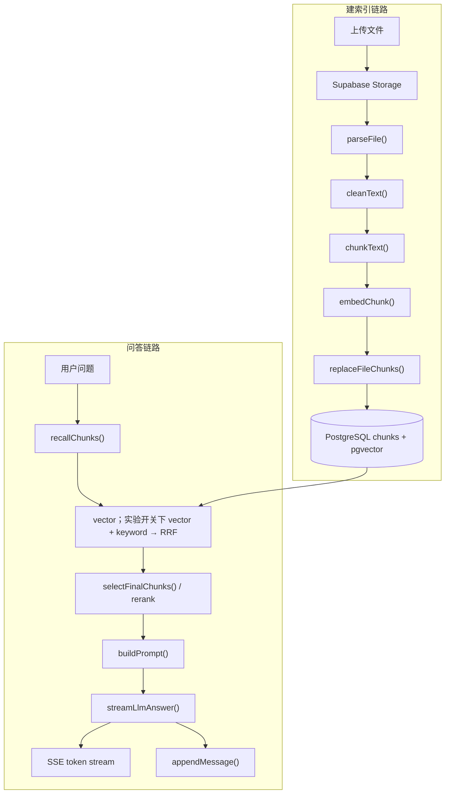

# RAG Pipeline 架构与流程

本文说明当前项目的 RAG（Retrieval-Augmented Generation）架构、端到端数据流、关键模块职责和主要调参点。项目是 Next.js App Router 应用，核心存储是 PostgreSQL + pgvector，模型调用走 OpenRouter 兼容接口。

---

## 1. 总体架构

RAG 系统分为两条主链路：

1. **建索引链路**：文件上传后解析文本，切分为 chunk，生成 embedding，写入 `chunks` 表。
2. **问答链路**：用户提问后生成 query embedding，在当前知识库内检索相关 chunk，必要时 rerank，拼接 prompt，再流式调用 LLM。



---

## 2. 核心目录与职责

| 路径 | 职责 |
| --- | --- |
| `app/api/files/[id]/parse/route.ts` | 文件解析和索引入口，负责更新文件状态 |
| `lib/rag/reindex.ts` | 建索引编排：storage -> parse -> clean -> chunk -> embed -> replace |
| `lib/rag/parse.ts` | PDF、DOC、DOCX、TXT、MD 文本解析 |
| `lib/rag/text.ts` | 无 storage/env 依赖的 `cleanText()`，真实索引与 demo seed 共用 |
| `lib/rag/chunks.ts` | chunk 切分、标题/章节识别、`embeddingText` 构造 |
| `lib/rag/embeddings.ts` | query 和 chunk embedding 生成，强校验 1536 维 |
| `lib/db/chunks.ts` | chunk 写入、读取、pgvector 与 pg_trgm 两条召回腿 |
| `lib/rag/retrieve.ts` | chat/eval 共用的 recall、hybrid 开关、rerank 和 top-K 参数 |
| `lib/rag/fusion.ts` | vector / keyword 的 RRF 排名融合 |
| `lib/rag/rerank.ts` | rerank 编排，失败时回退到向量检索顺序 |
| `lib/llm/prompts.ts` | QA、总结、会话标题 prompt 模板 |
| `lib/llm/chat.ts` | prompt 选择、LLM 流式调用、非流式生成 |
| `app/api/chat/stream/route.ts` | 聊天 RAG pipeline 的当前主入口 |

---

## 3. 建索引链路

入口：

```text
POST /api/files/[id]/parse
```

主流程在 `lib/rag/reindex.ts`：

```typescript
const filePath = `${file.id}${extname(file.name)}`;
const buffer = await readFileFromStorage(filePath);
const text = cleanText(await parseFile(file, buffer));
let chunkDocs = chunkText(text, file.id, { fileName: file.name });
chunkDocs = await embedChunk(chunkDocs, { signal });
await replaceFileChunks(file.id, chunkDocs);
return chunkDocs.length;
```

### 3.1 文件状态

解析接口会维护 `files.status`：

| 状态 | 含义 |
| --- | --- |
| `uploaded` | 文件已上传，尚未索引 |
| `parsing` | 正在解析、分块、向量化 |
| `indexed` | chunk 和 embedding 已写入数据库 |
| `failed` | 解析或索引失败 |

### 3.2 文本解析

`parseFile()` 根据 MIME type 和文件名后缀选择解析器：

| 文件类型 | 解析方式 |
| --- | --- |
| PDF | `pdf2json` 提取文本 |
| DOCX | `mammoth.extractRawText()` |
| DOC | LibreOffice 转 DOCX 后再用 mammoth |
| TXT / MD / `text/*` | 直接按 UTF-8 读取 |

不支持的类型会抛出 `Unsupported file type`。

### 3.3 文本清洗

`cleanText()` 位于无副作用的 `lib/rag/text.ts`，真实上传索引与 demo seed 共用同一实现：

```typescript
text
  .replace(/\r\n?/g, '\n')
  .replace(/^-+Page \(\d+\) Break-+$/gm, '')
  .replace(/\n{2,}/g, '\n')
  .replace(/[ \t]+/g, ' ')
  .trim()
```

目标是统一换行并移除 pdf2json 的整行 page-break marker，同时减少重复空白；不会用裸
`/Page \d+/` 误删正文中的 “Page 5” 等合法内容。

### 3.4 Chunk 切分

`chunkText()` 默认参数：

| 参数 | 当前默认值 | 作用 |
| --- | --- | --- |
| `chunkSize` | `500` | 每个 chunk 的目标字符数 |
| `overlap` | `50` | 相邻 chunk 的重叠字符数 |

切分策略：

1. 扫描文档首个非空行作为 `documentTitle`，文件名作为兜底。
2. 识别 Markdown 标题和中文章节标题作为**硬边界**：chunk 不跨章节，overlap 不越过节首，每个 chunk 的 `sectionTitle` 即其所属章节（评估见 `docs/evals/chunking-section-split-2026-07-10.md`）。
3. 章节内部优先在换行、句号、问号、感叹号、分号等边界截断。
4. 为 embedding 构造上下文增强文本：

```text
title: <document title>
section: <section title>
text:
<chunk text>
```

注意：`embeddingText` 用于 embedding 和 rerank；展示、引用和 prompt 仍使用原始 `text`。

### 3.5 Embedding 写入

`embedChunk()` 批量调用 embedding 接口，并把向量挂到每个 `Chunk.embedding` 上。当前要求 embedding 必须是 1536 维，因为数据库列是：

```typescript
embedding: vector('embedding', { dimensions: 1536 })
```

写入由 `replaceFileChunks()` 完成：

1. 开启事务。
2. 删除该文件旧 chunk。
3. 插入新 chunk、`embeddingText`、标题、元数据和 vector。
4. 提交事务；失败则回滚。

---

## 4. 问答链路

入口：

```text
POST /api/chat/stream
```

当前主流程在 `app/api/chat/stream/route.ts`，核心步骤如下：

```typescript
const recalledChunks = await recallChunks(message, {
  knowledgeBaseId: conversation.knowledgeBaseId,
  filter: retrievalFilter,
  signal: request.signal,
});
const finalChunks = await selectFinalChunks(
  message,
  recalledChunks,
  'auto',
  request.signal,
);
const prompt = buildPrompt(message, finalChunks);

await streamLlmAnswer(send, prompt, request.signal, requestId, {
  history,
  modelId,
  onComplete,
});
```

### 4.1 请求校验与上下文

聊天接口会先处理：

1. 用户鉴权：`requireUser()`。
2. body 解析和 `requestId` 校验。
3. `message`、`conversationId`、`knowledgeBaseId` UUID 校验。
4. 确认 conversation 存在，并且属于指定知识库。
5. 读取最近 8 条历史消息作为 LLM chat history。
6. 先持久化用户消息，再开始 SSE 输出。

如果会话仍是默认标题，会异步生成标题，不阻塞主 RAG 流程。

### 4.2 Query Embedding

`embedText(message)` 将用户问题转为 `number[1536]`。provider 配置在 `lib/models.ts`：

| 环境变量 | 默认值 |
| --- | --- |
| `OPENROUTER_API_KEY` | 必填 |
| `OPENROUTER_BASE_URL` | `https://openrouter.ai/api/v1` |
| `OPENROUTER_EMBEDDING_MODEL` | `text-embedding-3-small` |
| `OPENROUTER_EMBEDDING_DIMENSIONS` | `text-embedding-3*` 默认 1536 |

任何 embedding 维度不等于 1536 都会直接报错，避免写入或检索时和 pgvector schema 不匹配。

### 4.3 Recall（默认 vector，实验 hybrid）

`searchChunks()` 使用 pgvector cosine distance：

```sql
SELECT c.id::text,
       c.file_id AS "fileId",
       c.idx,
       c.text,
       c.embedding_text AS "embeddingText",
       c.document_title AS "documentTitle",
       c.section_title AS "sectionTitle",
       c.meta,
       f.name AS "fileName",
       c.embedding <=> $1::vector AS distance
FROM chunks c
JOIN files f ON c.file_id = f.id::uuid
WHERE c.embedding IS NOT NULL
  AND c.embedding <=> $1::vector < $2
  AND f.knowledge_base_id = $3::uuid
ORDER BY c.embedding <=> $1::vector
LIMIT $4
```

聊天链路当前参数：

| 参数 | 当前值 |
| --- | --- |
| `topK` | `20` |
| `maxDistance` | `0.6` |
| `knowledgeBaseId` | 当前 conversation 所属 KB |
| `filter` | 可选 `RetrievalFilter`（`fileIds` / `fileTypes` / `titleQuery`），编译为额外 `WHERE` 条件，维度间 AND、维度内 OR |

检索结果会把 distance 临时放入：

```typescript
chunk.meta._distance
```

该值只用于本次请求，不写回数据库。

**混合召回（默认关闭）**：当 `HYBRID_SEARCH_ENABLED=true` 时，`recallChunks`
会额外跑一条 pg_trgm 关键词腿（`keywordSearchChunks`，得分写入 `meta._keywordSim`），
与向量腿通过 Reciprocal Rank Fusion 融合（`reciprocalRankFusion`，
`lib/rag/fusion.ts`，得分写入 `meta._rrfScore`）。关键词腿与 embedding 调用并发，
两腿共用同一 KB scope 与 filter，关键词腿失败时降级为纯向量。默认关闭是因为内置 eval
显示在当前数据集上融合无收益（见 ADR-010）；因此聊天链路默认仍是纯向量召回。

### 4.4 Rerank

`rerankChunks()` 对 recall 结果重新排序。当前参数：

| 参数 | 当前值 |
| --- | --- |
| `topN` | `8` |
| `RERANK_ENABLED` | 默认 `true` |
| `OPENROUTER_RERANK_MODEL` | 默认 `cohere/rerank-v3.5` |

跳过条件：

1. `RERANK_ENABLED=false`。
2. recall 结果数量小于等于 1。
3. query 为空。

失败策略：

1. 网络错误、接口错误、返回格式异常都不会中断聊天。
2. 函数会记录错误并回退到 vector recall 的原始顺序。
3. 成功时把分数临时写入 `chunk.meta._rerankScore`。

### 4.5 Final Context

rerank 后只取前 5 个 chunk 进入 prompt：

```typescript
const finalChunks = rerankedChunks.slice(0, 5);
```

这样做的权衡：

1. recall 取 20，保证候选覆盖率。
2. rerank 取 8，提高精排后的可选择空间。
3. prompt 只放 5，控制上下文长度和噪声。

### 4.6 Prompt 构造

`buildPrompt(question, finalChunks)` 会先判断问题是否是总结类：

| 类型 | Prompt |
| --- | --- |
| 总结类，且有 chunk | `buildSummaryPrompt()` |
| 总结类，但无 chunk | `buildConversationSummaryPrompt()` |
| 普通问答 | `buildQaPrompt()` |

普通 QA prompt 的核心约束：

1. 只能使用提供的 context。
2. 找不到答案时必须拒答。
3. 引用只能使用 `[1]`、`[2]` 这种编号。
4. 不能使用外部知识。
5. 不能引用不支持答案的 chunk。

context 格式：

```text
[1] <chunk.text>

[2] <chunk.text>
```

### 4.7 LLM 流式生成

`streamLlmAnswer()` 调用 OpenRouter chat completions：

```typescript
{
  model: provider.model,
  stream: true,
  messages: [
    ...history,
    { role: 'user', content: prompt },
  ],
}
```

模型选择优先级：

1. 请求 body 中的 `model`，且必须在 `lib/llm/catalog.ts` 中存在。
2. `conversations.model` 已保存的模型。
3. `OPENROUTER_CHAT_MODEL`。
4. catalog 默认模型。

流式响应中的每个 text delta 会继续转发给浏览器：

```text
event: token
data: {"delta":"..."}
```

### 4.8 结果持久化

LLM 完成后，`onComplete` 会写入助手消息：

```typescript
await appendMessage(
  conversationId,
  'assistant',
  fullText,
  retrievedChunks,
  requestId,
);

await touchConversation(conversationId);
```

`retrievedChunks` 会存入 `messages.retrieved_chunks`，用于后续重新打开会话时恢复引用面板。

---

## 5. SSE 事件顺序

聊天接口返回 `text/event-stream`，典型顺序：

```text
progress { requestId, stage: "searching" }
progress { requestId, stage: "searched", recalledCount }
progress { requestId, stage: "reranking" }
progress { requestId, stage: "reranked", finalCount, rerankSkipped }
meta     { requestId, retrievedChunks }
progress { requestId, stage: "generating" }
token    { delta }
token    { delta }
done     { requestId }
```

如果 rerank 被跳过，`reranking` 事件不会发送，但仍会发送：

```text
progress { requestId, stage: "reranked", finalCount, rerankSkipped: true }
```

异常时发送：

```text
error { requestId, message }
```

新会话首问时，标题异步生成完成后还会插入一条（时机不定）：

```text
title { requestId, conversationId, title }
```

---

## 6. Citation 与 retrievedChunks

进入 prompt 的每个 chunk 会映射为一个 `RetrievedChunk`：

```typescript
{
  index: i + 1,
  chunkId: c.id,
  fileId: c.fileId,
  fileName: c.fileName ?? c.fileId,
  page: meta.page,
  quote: c.text.slice(0, 300),
  score,
  scoreType,
}
```

分数来源：

| 条件 | `score` | `scoreType` |
| --- | --- | --- |
| 有 `_rerankScore` | rerank relevance score | `rerank` |
| 没有 rerank，但有 `_distance` | `Math.max(0, 1 - distance)` | `vector` |
| 没有 rerank 与 `_distance`，但有 `_keywordSim`（hybrid 关键词腿命中） | `_keywordSim`（word_similarity） | `keyword` |
| 都没有 | `undefined` | `undefined` |

前端会根据回答正文里的 `[1]`、`[2]` 等编号匹配 `retrievedChunks.index`，从而展示引用来源。

---

## 7. 数据模型

RAG 相关核心表：

| 表 | 作用 |
| --- | --- |
| `knowledge_bases` | 知识库元数据 |
| `files` | 上传文件元数据和索引状态 |
| `chunks` | 文本片段、embedding、标题、元数据 |
| `conversations` | 知识库下的会话 |
| `messages` | 用户和助手消息，助手消息保存引用元数据 |

`chunks` 关键字段：

| 字段 | 说明 |
| --- | --- |
| `id` | chunk 主键，当前格式为 `${fileId}-${idx}` |
| `file_id` | 所属文件 |
| `idx` | 文件内 chunk 序号 |
| `text` | 原始 chunk 文本，用于 prompt、展示、引用 |
| `embedding_text` | 带标题/章节上下文的文本，用于 embedding 和 rerank |
| `document_title` | 文档标题 |
| `section_title` | 章节标题 |
| `meta` | JSON 元数据，如 `{ start, end, page }` |
| `embedding` | `vector(1536)`，用于 pgvector 检索 |

索引：

```typescript
index('chunks_file_idx').on(table.fileId, table.idx)
index('chunks_embedding_hnsw').using(
  'hnsw',
  table.embedding.op('vector_cosine_ops'),
)
```

---

## 8. 调试和评测入口

### 8.1 纯检索接口

```text
POST /api/rag/search
```

用途：调试 query embedding、vector search 和 pg_trgm 关键词检索。

请求字段：

| 字段 | 说明 |
| --- | --- |
| `query` | 必填，检索文本 |
| `knowledgeBaseId` | 与 `fileId` 二选一必填，在整个 KB 内检索 |
| `fileId` | 与 `knowledgeBaseId` 二选一必填，只检索单个文件 |
| `mode` | 可选，`vector`（默认）/ `keyword` / `hybrid`；`keyword` 走 pg_trgm `word_similarity` 对 `embedding_text` 做三元组匹配，不调用 embedding，得分写入 `meta._keywordSim`；`hybrid` 用 RRF 融合向量腿和关键词腿（`lib/rag/fusion.ts`，得分写入 `meta._rrfScore`） |
| `topK` | 默认 `5`，范围 `1..20` |
| `maxDistance` | 默认 `0.6`，范围 `0..1`，`vector` 与 `hybrid` 模式校验和使用（作用于向量腿） |
| `filter` | 可选 `RetrievalFilter`：`{ fileIds?, fileTypes?, titleQuery? }`，维度间 AND、维度内 OR，两种 mode 都生效 |

注意：接口要求登录，且经 `lib/authz/access.ts` 校验 KB / 文件归属；`fileId` 与 `filter.fileIds` 同时给出时取交集（可能为空，不算错误）。

### 8.2 Eval

Eval 相关代码在：

| 路径 | 作用 |
| --- | --- |
| `app/api/eval/run/route.ts` | 启动评测（curated 数据集，支持 `filter`） |
| `app/api/eval/runs/*` | 历史 run 列表 / 详情 |
| `app/api/eval/validate/route.ts` | 校验数据集 |
| `lib/eval/dataset.ts` | 数据集加载 |
| `lib/eval/runner.ts` | 跑 RAG case、对比 rerank 分支 |
| `lib/eval/metrics.ts` | recall、precision、NDCG、MRR 等指标 |
| `lib/eval/relevance.ts` | retrieved chunk 相关性打分 |
| `lib/eval/judge.ts` | LLM judge（faithfulness / answer relevance） |

Eval 和聊天链路复用 `recallChunks()`、`selectFinalChunks()`、`buildPrompt()`、`generateAnswer()`，因此 hybrid scope/filter 与排序逻辑不会产生两套实现。

检索级 vector / hybrid A/B 使用：

```bash
pnpm eval:hybrid-ab -- --knowledge-base-id=<uuid> --dataset=olympus-zh --rerank=on --repetitions=3
```

命令输出 retrieval hit rate、Recall/Precision@n、nDCG、MRR，以及从 query embedding 到最终 chunk 的平均/p50/p95 延迟；vector 与 hybrid 按 case 交错执行以减少网络时序偏差。当前可复现实测见 `docs/evals/hybrid-ab-2026-07-10.md`。

---

## 9. 主要调参点

| 参数 | 当前位置 | 当前值 | 影响 |
| --- | --- | --- | --- |
| chunk size | `lib/rag/chunks.ts` | `500` | chunk 过大降低定位精度，过小丢上下文 |
| overlap | `lib/rag/chunks.ts` | `50` | 提高跨 chunk 命中，但增加存储和召回重复 |
| embedding dimensions | `lib/rag/embeddings.ts` / `lib/models.ts` | `1536` | 必须匹配 DB schema |
| chat recall topK | `lib/rag/retrieve.ts` (`RETRIEVAL`) | `20` | 候选覆盖率 |
| chat maxDistance | `lib/rag/retrieve.ts` (`RETRIEVAL`) | `0.6` | 过滤弱相关 chunk |
| rerank topN | `lib/rag/retrieve.ts` (`RETRIEVAL`) | `8` | rerank 后候选窗口 |
| final chunks | `lib/rag/retrieve.ts` (`RETRIEVAL`) | `5` | prompt 成本和证据噪声 |
| history messages | `app/api/chat/stream/route.ts` | `8` | 多轮上下文长度 |
| rerank enabled | `lib/models.ts` | `RERANK_ENABLED=true` | 是否启用精排 |
| hybrid recall | `lib/models.ts` | `HYBRID_SEARCH_ENABLED=false` | 是否融合关键词腿（RRF）；默认关闭，见 ADR-010 |

---

## 10. 失败策略

| 阶段 | 失败行为 |
| --- | --- |
| 文件解析 | 文件状态更新为 `failed`，接口返回 `{ requestId, ok: false, error }` |
| embedding | 直接报错，避免维度错误或空向量进入检索 |
| vector search | 抛错并发送 SSE `error` |
| rerank | 记录错误，回退到 recall 原顺序 |
| LLM 请求 | 发送 SSE `error`，不写入空助手消息 |
| assistant 持久化 | 记录 `onComplete` 错误，不影响已经发送到前端的 token |

---

## 11. 后续演进建议

当前聊天 RAG 编排直接写在 `app/api/chat/stream/route.ts` 中。若后续需要在 chat、eval、debug API 中复用完全一致的流程，可以抽出：

```text
lib/rag/pipeline.ts
```

建议接口：

```typescript
type RunRagPipelineInput = {
  question: string;
  knowledgeBaseId: string;
  signal?: AbortSignal;
};

type RunRagPipelineResult = {
  recalledChunks: Chunk[];
  finalChunks: Chunk[];
  retrievedChunks: RetrievedChunk[];
  prompt: string;
};
```

这样 route handler 只负责鉴权、请求校验、SSE 事件和消息持久化；RAG 召回、rerank、prompt 构造则集中在一个可测试的模块中。
