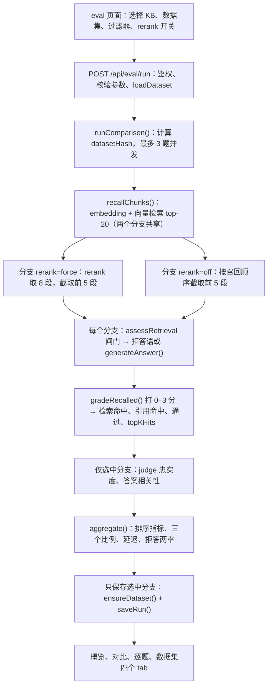

# KnowFlow Eval：指标整理与实现

核查基准：`main` 的 `688c665`（2026-09-23）。这次只读了源码，用项目自己的指标函数跑过文中的算例，并运行了两个 eval 单测文件（7/7 通过）；没有对真实知识库跑评测，也没有调用模型，所以文中没有“实测分数”。概念学习与练习记录在 [eval-notes.md](eval-notes.md)；本文只回答两件事：**每个数字怎么算**，以及**从点“运行评测”到页面出数，代码走了哪些步**。

想看总览读第 1 节；想知道某个数怎么来读第 2～7 节；想看代码链路读第 8 节；看面板前先过第 9 节。

## 1. 指标总表

所有 @K 指标都只看**最终进入 prompt 的片段**：召回 20 段 → rerank 取 8 段 → 截取前 5 段（`RETRIEVAL.finalTopK = 5`）。所以 K 最大到 5 才有意义，页面一律展示 K=5。

**检索排序**（看最终 ≤5 段的相关性分级，见第 2、3 节）

| 指标 | 问什么 | 单题怎么算 | 聚合分母 | 落库列 | 页面 |
| --- | --- | --- | --- | --- | --- |
| Hit@K（K=1/3/5） | 前 K 条里有没有相关片段 | 有 grade≥2 记 1，否则 0 | 仅可回答题；一题都没有则为 null | `hit_at_k` | 卡片、排行榜、对比、趋势图 |
| Precision@K | 返回的片段里相关的占几成 | 前 K 中 grade≥2 的数量 ÷ **实际返回数** | 全部题，不可回答题记 0 | `precision_at_k` | 卡片、排行榜、对比 |
| MRR | 第一个相关片段排第几 | 1 ÷ 首个 grade≥2 的名次，没有记 0 | 全部题，不可回答题记 0 | `mrr` | 排行榜、对比 |
| nDCG@K | 分级与名次综合的排序质量 | DCG ÷ 同一列表重排后的 DCG | 全部题，不可回答题记 0 | `ndcg_at_k` | **不展示** |
| 旧口径 Hit@5 | 历史 run 的原值 | 原名 Recall@K，含不可回答题（空检索记 1） | 全部题 | `recall_at_k`（已停写） | 排行榜、对比、趋势图 |

**规则判定**（每题一个 true/false，再求比例，见第 4 节）

| 指标 | 问什么 | 单题怎么算 | 聚合分母 | 落库列 | 页面 |
| --- | --- | --- | --- | --- | --- |
| 检索命中率 | 检索这一关过没过 | 可回答：有 grade≥2；不可回答：没有 grade≥2 | 全部题 | `retrieval_hit_rate` | 排行榜；逐题 ✓/✗ |
| 引用命中率 | 引用格式与关键词规则过没过 | 可回答：有 `[数字]` 且含任一预期关键词；不可回答：没有 `[数字]` | 全部题 | `citation_hit_rate` | 仅逐题 ✓/✗ |
| 通过率 | 整道题过没过 | 无流水线错误 ∧ 检索命中 ∧ 引用命中 | 全部题 | `passed_cases` / `total_cases` | 对比页配置、下拉标签、散点气泡 |

**LLM 裁判**（0～1 分，见第 5 节）

| 指标 | 问什么 | 单题怎么算 | 聚合分母 | 落库列 | 页面 |
| --- | --- | --- | --- | --- | --- |
| 忠实度 Faithfulness | 回答的说法有没有片段支撑 | judge 读片段与回答后打分 | 只平均非空分数 | `avg_faithfulness` | 卡片、排行榜（按它排序）、对比、趋势、散点 |
| 答案相关性 | 是否正面回答了问题 | judge 读问题与回答后打分 | 只平均非空分数 | `avg_answer_relevance` | 卡片、排行榜、对比 |

Judge 跳过不可回答题、闸门拒答和流水线错误，且只评选中的 rerank 分支。

**拒答**（见第 6 节）

| 指标 | 问什么 | 单题怎么算 | 聚合分母 | 落库列 | 页面 |
| --- | --- | --- | --- | --- | --- |
| OOS 拒答率 | 不可回答题被**代码闸门**拒掉几成 | 闸门触发记 1 | 仅不可回答题 | 不落库 | 不展示，只在 API 返回里 |
| 可回答题误拒率 | 可回答题被闸门误拒几成 | 闸门触发记 1 | 仅可回答题 | 不落库 | 不展示，只在 API 返回里 |

**成本**（见第 7 节）

| 指标 | 问什么 | 怎么算 | 聚合分母 | 落库列 | 页面 |
| --- | --- | --- | --- | --- | --- |
| 平均延迟 | 每题耗时 | 分支开始（召回之后）→ 拿到完整答案 | 全部题 | `avg_latency_ms` | 卡片、排行榜、对比、散点 |
| p50 / p95 延迟 | 延迟分布 | 最近秩分位数 | — | 不落库 | 只有 `eval:hybrid-ab` 输出 |

## 2. 地基：片段相关性分级

检索类指标和“检索命中”都建立在 [relevance.ts](../../lib/eval/relevance.ts) 的 `gradeChunk` 上：把每个最终片段和题目标注比对，打 0～3 分。

| grade | 条件 | 算“相关”吗（≥2） |
| --- | --- | --- |
| 3 | 片段文本包含任一 `targetChunkSubstrings`（区分大小写），不看文件名 | 是 |
| 2 | 文件名在 `targetFileNames` 中，且文本包含任一 `expectedKeywords`（不区分大小写的子串匹配） | 是 |
| 1 | 文件名命中，但一个关键词都没有 | 否 |
| 0 | 都不满足 | 否 |

以 `olympus-funding` 为例，它的标注是：文件 `sample.txt`；子串 `420 million credits`、`United Mars Consortium`；关键词 `420 / million / credits / consortium`。

- 含 “420 million credits” 的片段 → 3，即使它来自改名后的文件；
- 来自 `sample.txt`、没有子串但出现了 “consortium” → 2；
- 来自 `sample.txt`、四个关键词都没出现 → 1；
- 来自其他文件、也不含子串 → 0。

要点：

- 这是**规则自动标注**，不是人工逐段判断。“相关”的意思是“规则认为相关”。
- 相关阈值 `RELEVANT_THRESHOLD = 2` 在 `metrics.ts:21`；nDCG 直接使用 0～3 的原始分。
- 不可回答题的三类标注都是空数组，它们的每个片段都是 0 分。第 4 节中几个“白送”的现象都来源于此。

## 3. 检索排序指标

计算都在 [metrics.ts](../../lib/eval/metrics.ts)。下面统一使用一组算例，数值由项目函数实际算出：

| 题 | 类型 | 最终片段的 grade（按名次） |
| --- | --- | --- |
| A | 可回答 | 3, 0, 2, 1, 0 |
| B | 可回答 | 0, 1, 2, 0, 0 |
| C | 可回答 | 1, 0（只返回 2 段） |
| D | 不可回答 | 0, 0, 0 |

| 题 | Hit@1 | Hit@3 | Hit@5 | P@1 | P@3 | P@5 | 倒数排名 | nDCG@5 |
| --- | ---: | ---: | ---: | ---: | ---: | ---: | ---: | ---: |
| A | 1 | 1 | 1 | 1 | 0.667 | 0.4 | 1 | 0.951 |
| B | 0 | 1 | 1 | 0 | 0.333 | 0.2 | 0.333 | 0.587 |
| C | 0 | 0 | 0 | 0 | 0 | 0 | 0 | **1.000** |
| D | 不参与 | 不参与 | 不参与 | 0 | 0 | 0 | 0 | 0 |
| **聚合** | 1/3 | 2/3 | 2/3 | 0.25 | 0.25 | 0.15 | 0.333 | 0.634 |

Hit 的分母是 3（A、B、C）；其他指标的分母是 4，D 记 0 也算在内。

### 3.1 Hit@K

`hitAtK`（`metrics.ts:29`）。聚合时只取可回答题（`:86`、`:91`）；没有任何可回答题时返回 null（`:97`），页面显示“—”，避免被误读成“检索全挂”。

- 最终列表最多 5 段，所以**可回答题的 Hit@5 与该题的检索命中是同一个判断**。二者汇总值不同，只是因为检索命中率把不可回答题也放进了分母。
- 它不是 Recall：项目没有“应该找到的全部证据”清单（见 eval-notes 第 4 节第 2 条）。
- 每题的 Hit@1/3/5 也保存在 `eval_run_items.top_k_hits`，但页面没有渲染；`shared.tsx` 中的 `TopKRow` 组件没有被引用。

### 3.2 Precision@K

`precisionAtK`（`metrics.ts:37`）。

- 分母是**实际返回数**（`ranked.length`），不是 K。只返回 2 段且都相关（grade 为 2、2）时，P@5 = 100%，不是 40%。空结果记 0。
- 不可回答题记 0，并且留在分母里。`olympus` 和 `olympus-zh` 各有 9 道可回答题加 7 道不可回答题，所以这两套数据**即使检索完美，Precision / MRR / nDCG 的平均值最高也只有 9/16 = 56.25%**。`cmrc2018-mini` 的 100 道题全部可回答，不受这个上限约束。看到 P@5 = 50%，不能直接理解为“一半是噪声”。

### 3.3 MRR

`mrr`（`metrics.ts:45`）：在整个最终列表中找第一个 grade≥2，取名次的倒数。列表最多 5 段，所以实际是 MRR@5。它只看第一个相关片段是否靠前，不关心后面还有没有其他相关片段。

对照：[hybrid-ab-2026-07-10.md](../evals/hybrid-ab-2026-07-10.md) 中，开启 rerank 时 MRR = 0.900。当时 `olympus-zh` 是 9 道可回答题加 1 道不可回答题，上限正好是 9/10 = 0.9。也就是说，9 道可回答题的第一名全部相关，已经到达上限。

### 3.4 nDCG@K

`ndcgAtK`（`metrics.ts:51-63`）：

- 增益为 `2^grade − 1`，grade 3/2/1/0 分别对应 7/3/1/0；名次折扣为 `log2(名次 + 1)`。
- A 的 DCG@5 = 7/1 + 0 + 3/2 + 1/log2(5) + 0 ≈ 8.931；理想顺序 3、2、1、0、0 的 IDCG ≈ 9.393；nDCG ≈ 0.951。
- **理想顺序只来自这次返回的片段**，不是全语料。C 只返回一个 grade 1 片段和一个 0 分片段，这已经是“最好的顺序”，所以 nDCG = 1.0；同时它的 Hit、Precision 和 MRR 都是 0。nDCG 衡量“返回的片段排得好不好”，不衡量“有没有找对”。
- 它已计算并落库，但三个页面都没有选用；只有 A/B 脚本打印 nDCG@3。

### 3.5 旧口径 Hit@5

提交 `54958fb` 和迁移 017 之前，这一列叫 Recall@K，实际计算的是命中率，而且包含不可回答题（空检索记 1，非空记 0）。现在：

- 历史值原样保留在 `recall_at_k`，**不回填**到 `hit_at_k`；新 run 不再写入 `recall_at_k`。
- 页面单列为“Hit@5（旧口径）”，只出现在排行榜、对比页和趋势图，不作为指标卡片；新旧两列之间不计算差值，`history-metrics.test.ts` 锁定了这一行为。

## 4. 规则判定：检索命中、引用命中、通过率

逐题判定在 [runner.ts](../../lib/eval/runner.ts) 的 `buildCaseResult`（`:216-283`）：

| | 可回答题 | 不可回答题 |
| --- | --- | --- |
| 检索命中 `retrievalHit` | 最终片段里至少有一个 grade≥2 | 最终片段里没有 grade≥2 |
| 引用命中 `citationHit` | 答案含 `[数字]`，且含任一预期关键词（关键词为空时只看引用） | 答案不含 `[数字]` |
| 通过 `passed` | 无流水线错误 ∧ 检索命中 ∧ 引用命中 | 同左 |
| 失败原因 | 出错时只记 `pipeline_error`；否则 `retrieval_miss` 与 `citation_miss` 可同时出现 | 同左 |

检索命中率和引用命中率都是“命中题数 ÷ 全部题数”（`runner.ts:314-319`）；通过率由页面按 `passedCases / totalCases` 计算（`shared.tsx:136`），分母同样是全部题。

读数时需要知道：

1. **不可回答题的检索命中是白送的。** 它们的片段全是 0 分，“没有 grade≥2”恒成立，即使流水线报错、什么都没检索到也一样。当前数据集的检索命中率下限是 7/16 = 43.75%：即使 9 道可回答题全部没检索到，这个比例也不会低于它。
2. **不可回答题的引用命中只检查“没有 `[数字]`”。** 固定拒答语、模型说“上下文里没有”都能通过；一段没有引用的编造内容也能通过。`runner.ts:301-305` 的注释明确说明了这一点，因此才另设拒答指标。
3. **可回答题的引用命中只检查格式和关键词。** 它不核对 `[1]` 指向的片段是否真的支持那句话；关键词只需命中一个。`olympus-dust-storms` 的关键词是 tharsis / dust / 18 / perihelion，只要答案带有 `[1]` 这类引用，并复述了问题中的 “Tharsis dust storms”，就算命中，即使把 18% 答成 25%。
4. **`expectedAnswer` 不参与任何打分**，只在逐题页与生成答案并排展示（`lib/types.ts` 的注释写明它是为“参考答案式评分”预留的）。
5. Judge 分数不影响 `passed`。

## 5. LLM 裁判

[judge.ts](../../lib/eval/judge.ts) 让模型读完输入后给出一个 0～1 分：

| | 输入 | 提示词要点 |
| --- | --- | --- |
| 忠实度 | 编号片段 + 回答 | 每个事实陈述都直接得到片段支持才给 1.0；无依据、矛盾或编造的陈述会扣分；不评价文风和完整性 |
| 答案相关性 | 问题 + 回答 | 完整、直接地回应才给 1.0；回避、只答一部分、跑题或注水都会扣分；不评价事实是否正确 |

两个提示词都要求只返回 `{"score": <0～1>}`。

实现细节：

- **整体打一个分，不是逐条拆解再计数。** 学习笔记里“2 个陈述、1 个有依据 → 50%”的算法由 judge 模型自行完成，代码拿不到中间过程。
- **解析方式**（`judge.ts:21`）：取回复中的第一个数字，并限制在 [0, 1]。`{"score": 0.8}` → 0.8；如果模型没有遵守格式、回复 “8/10”，会取到 8 并被限制为 1.0。没有数字或调用出错时为 null。
- **哪些题会被评**（`runner.ts:143`）：API 固定开启评分（`run/route.ts:62` 的 `judge: true`）；只评选中的 rerank 分支；跳过不可回答题、闸门拒答和流水线错误；没有片段时，忠实度也返回 null。
- **聚合方式**（`runner.ts:344`）：只平均非 null 分数。分母是“实际被评分的题数”，两次 run 可能不同。
- **使用的模型**：`EVAL_JUDGE_MODEL`；未设置时使用 `DEFAULT_CHAT_MODEL_ID`，即模型目录第一项 `openrouter/free`（界面标为 Auto，由 OpenRouter 路由）。生成答案的 `generateAnswer` 没有传入模型，使用 `OPENROUTER_CHAT_MODEL`；未设置时同样是 `openrouter/free`。因此在默认配置下，答题和判卷使用同一个路由入口；请求没有设置 temperature；两个模型名都不落库，事后无法确认两次 run 是否使用了同一个裁判模型。

## 6. 拒答指标与阈值校准

### 6.1 runner 中的两个比例

`aggregate`（`runner.ts:306-331`）：

- OOS 拒答率 = 不可回答题中 `refused === true` 的比例；
- 可回答题误拒率 = 可回答题中 `refused === true` 的比例；
- 对应集合为空时为 null（`:338`）。

`refused` 只在代码闸门 `assessRetrieval` 返回 `empty` 或 `low_score` 时为真（`runner.ts:189-195`、`:279`）。**模型根据 prompt 自己说“没找到”不算。** ADR-011 端到端核对了两个数据集共 14 道不可回答题：全部被拒答，但其中只有 4 道由闸门拦下（召回为空），另外 10 道是模型拒答的。对同一批数据，这个指标只会反映前 4 道。

这两个比例，以及逐题的 `refused`、`refusalReason`、`maxRerankScore`，**都不写库，页面也不显示**，只存在于 `POST /api/eval/run` 返回的 JSON 中。`lib/llm/refusal.ts` 有 `isRefusalText()`，可以识别模型原样输出的拒答句，但 runner 没有用它统计“总拒答率”。

### 6.2 `pnpm eval:refusal`：rerank 分数下限校准

[eval-refusal.ts](../../scripts/eval-refusal.ts) 回答的问题是：rerank 最高分低于某个值时，要不要直接拒答？

1. 每题召回一次并强制 rerank，只记录最高 rerank 分和最终片段数；**不调用 LLM**。
2. 在 0～0.95 之间每隔 0.025 取一个阈值（共 39 档），用 `refusesAt` 复刻闸门：空结果必拒；阈值 ≤ 0 时不拒；否则最高分低于阈值就拒。
3. 每档计算 OOS 拒答率（越高越好）和可回答题误拒率（代价）。
4. 选择阈值：误拒率不得高于阈值为 0 时的基线（基线中的误拒来自“召回为空”，与阈值无关）；在满足条件的阈值中，取 OOS 拒答率最高的一档；并列时取中间那档。
5. 余量检查：若所选阈值距离最低分的可回答题不足 0.05，就发出警告。这个最低分只是小样本里的最小值，不是总体最小值。
6. 分离度检查：比较最低分的可回答题和最高分的不可回答题；二者重叠时，没有任何单一阈值能干净地区分两类题。
7. 留出验证：用 `--validate=` 指定另一个数据集和 KB，用同一阈值再算一次误拒率。

结论见 [ADR-011](../adr/011.refuse-on-empty-retrieval.md)：EN 数据集上最高分的不可回答题（0.9055）高于最低分的可回答题（0.8808）；EN 上选出的 0.875 距离那道可回答题只有 0.0058，拿到 ZH 留出集上会误拒 9 道可回答题中的 1 道（11.1%）。因此 `RETRIEVAL.minRerankScore = 0`，即关闭分数下限，只保留“召回为空就拒答”。

这就是学习笔记中“阈值权衡”练习的项目版本：提高分数下限，被拒答的集合变大，OOS 拒答率（相当于“不可回答”这一类的召回率）不会下降，但可回答题可能被误拒；阈值还要在没有参与选择的数据上验证。注意这里衡量代价的是误拒率（可回答题中被拒的比例），不是精确率。

## 7. 延迟

- **概览中的平均延迟**（`runner.ts:171`、`:209`）：每个分支从开始计时到拿到完整答案。召回（query embedding + 向量检索）在分支开始前共享执行，**不计入**；rerank（开启时）、闸门和 LLM 生成计入；judge 不计入。
- 两个分支并行，最多 3 题同时运行（`CASE_CONCURRENCY = 3`）。测到的是并发下的非流式耗时，与聊天中的首字延迟不是一回事。
- 被闸门拒答的题不调用 LLM，耗时很短。拒答变多时，平均延迟可能“变好”，但这不代表链路变快。
- 聚合时对全部题取平均（包括报错题），并四舍五入到毫秒。
- **A/B 脚本的延迟**（`eval-hybrid-ab.ts:163-173`）：从 embedding 计到最终 top-5，**包含召回，不包含 LLM**。p50/p95 使用最近秩法：排序后取第 ⌈p% × n⌉ 个（`:72`）。p95 延迟是分布的分位数，不是置信区间。

## 8. 一次评测是怎么跑完的

### 8.1 数据集

[dataset.ts](../../lib/eval/dataset.ts) 在代码中内置三个数据集：

| 名称 | 语言 | 对应 fixture | 题数 |
| --- | --- | --- | --- |
| `olympus` | EN | `tests/fixtures/sample.txt` | 16 = 9 可回答 + 7 不可回答 |
| `olympus-zh` | ZH | `tests/fixtures/sample-zh.txt` | 16 = 9 可回答 + 7 不可回答 |
| `cmrc2018-mini` | ZH | `tests/fixtures/cmrc2018-dev-*.txt`（25 篇） | 100，全部可回答 |

每道题（`EvalCase`，定义在 `lib/types.ts`）的字段和用途：

| 字段 | 用在哪里 |
| --- | --- |
| `id` | 题目主键，落库为 `case_key` |
| `question` | 检索和生成答案的输入 |
| `category` | 六类之一；`out_of_scope` 决定该题按不可回答处理（`isOutOfScope`，`dataset.ts:374`） |
| `difficulty` | easy / medium / hard，目前只在数据集 tab 展示，没有分组统计 |
| `targetChunkSubstrings` | grade 3 |
| `targetFileNames` | grade 1、2 |
| `expectedKeywords` | grade 2，以及可回答题的引用命中 |
| `expectedAnswer` | 只展示，不打分 |
| `notes` | 出题说明，只落库 |

编写不可回答题的两条规则（来自 `dataset.ts` 注释和 ADR-011）：先搜索整份 fixture，确认它确实答不了；每个数据集都要跑在只包含自身 fixture 的 KB 上，否则双语 KB 中另一种语言的文档可能回答本语言的“不可回答题”。

在页面上增删改题、运行前按 KB 做兼容性检查、并发修改保护等托管数据集功能在 [PR #45](https://github.com/Brant-Satoshi/KnowFlow/pull/45)。截至 2026-09-23，该 PR 仍处于 OPEN 状态且与 main 冲突，**不在 main 中**。

### 8.2 数据集校验（数据集 tab）

[validate.ts](../../lib/eval/validate.ts) 使用与 `gradeChunk` 相同的匹配规则，在磁盘 fixture 上检查每题的分级信号能否触发：

| 级别 | 问题码 | 含义 |
| --- | --- | --- |
| error | `missing_id` `duplicate_id` `missing_question` `invalid_category` `invalid_difficulty` | 结构或枚举错误 |
| error | `target_file_missing` | 目标文件不在 `tests/fixtures/` 中 |
| error | `substring_not_in_source` | 目标文件里找不到该子串，grade 3 永远无法触发 |
| warning | `keyword_not_in_source` | 目标文件里找不到该关键词，grade 2 可能无法触发 |
| warning | `keyword_not_in_expected_answer` | 关键词与标准答案不一致 |
| warning | `empty_keywords` `no_targets` | 可回答题缺少关键词或目标 |
| warning | `out_of_scope_has_targets` | 不可回答题却带有目标 |

它只检查磁盘 fixture，不检查目标 KB 实际包含哪些文件、切成了什么样；校验报告也不会阻止评测运行。

### 8.3 API

| 路由 | 作用 | 权限 |
| --- | --- | --- |
| `POST /api/eval/run` | 运行一次评测 | 登录 + 对 KB 有访问权 |
| `GET /api/eval/runs?knowledgeBaseId=` | 历史列表（只有汇总，新 run 在前） | 登录 + 对 KB 有访问权 |
| `GET /api/eval/runs/[id]` | 单次 run 及逐题结果 | 登录 + `requireEvalRunAccess` |
| `GET /api/eval/validate?dataset=` | 数据集校验报告 | 登录 |

`POST /api/eval/run` 的请求体包括：`knowledgeBaseId`（UUID）、`mode: "curated"`（唯一支持的模式）、`datasetName`、`useRerank`（默认 true）和可选的 `filter`（与聊天相同的 `RetrievalFilter`）。这是同步请求，全部题跑完才返回。

[run/route.ts](../../app/api/eval/run/route.ts) 中需要注意：

- 它调用 `runComparison(cases, { knowledgeBaseId, judge: true, useRerank, filter })` 得到两个分支，**只返回并保存 `useRerank` 选中的分支**。另一个分支也调用了 LLM 生成答案，成本照付，但结果被丢弃。
- 落库（`ensureDataset` + `saveRun`）失败时只打印日志，接口仍然返回成功。页面能看到本次结果，但历史中可能没有。

### 8.4 runner

[runner.ts](../../lib/eval/runner.ts) 的步骤：

1. `hashDataset(cases)`（`:74`）。
2. `mapLimit` 最多让 3 题并发运行（`:76`、`:354`）。
3. 每题执行 `runCase`：召回一次（`:119`，两个分支共享同一批候选）→ 两个分支并行执行 `runBranch`（`:130`）→ 选中分支送 judge（`:143`）→ 两个分支各自执行 `buildCaseResult`（`:153`、`:157`）。
4. 每个分支执行 `runBranch`：`selectFinalChunks(..., 'force' | 'off')`（`:179`）→ 闸门 `assessRetrieval`（`:189`）→ 拒答语或 `generateAnswer(buildPrompt(...))`（`:197`）→ 记录延迟（`:209`）。
5. `aggregate`（`:285`）：调用 `aggregateMetrics` 计算排序指标，再计算三个比例、judge 均值、拒答两率和平均延迟。

**与线上聊天相同的部分**：`RETRIEVAL` 参数、`recallChunks`、`selectFinalChunks`、`assessRetrieval`、`buildPrompt` 和拒答语。[retrieve.ts](../../lib/rag/retrieve.ts) 开头的注释说明了原因：eval 必须和线上聊天使用完全相同的检索方式。

**不同之处**：

- rerank 使用 `force` / `off`，不受 `RERANK_ENABLED` 影响；聊天使用 `auto`。
- 没有对话历史；使用非流式 `generateAnswer`；模型来自环境默认值，不是会话中选择的模型。
- 召回模式跟随 `HYBRID_SEARCH_ENABLED`（默认 vector）。`RunCuratedEvalOpts` 支持 `retrievalMode` 和 `refusalGate: false`，但 API 没有暴露这两个选项，只能在代码中调用。

### 8.5 落库

相关代码在 [lib/db/eval.ts](../../lib/db/eval.ts) 和 [schema/eval.ts](../../lib/db/schema/eval.ts)。

| 表 | 一行代表什么 | 怎么写入 |
| --- | --- | --- |
| `eval_datasets` | 一个数据集（名称唯一，含 `dataset_hash`、`case_count`） | `ensureDataset` 按名称查找；不存在就创建；hash 变化时更新记录并整批替换题目 |
| `eval_cases` | 数据集中的一道题 | 同上 |
| `eval_runs` | 一次 run 的汇总：配置（KB、数据集名称与 hash、rerank、filter）和各项汇总指标 | `saveRun`，与 items 在同一事务中写入 |
| `eval_run_items` | 一次 run 中的一道题：通过情况与失败原因、两个命中、延迟、片段预览、`top_k_hits`、答案、标准答案、`graded_hits`、两个 judge 分数 | 同上 |

迁移演进：006 创建四张表（当时指标列叫 `recall_at_k`）→ 009 增加 judge 的两列 → 012 增加 `filter` → 017 增加 `hit_at_k`（保留旧列，不回填）。

**没有落库的内容**：拒答两率和逐题的 `refused` / `refusalReason` / `maxRerankScore`；未选中的分支；答题模型和 judge 模型；召回模式（vector / hybrid）以及 `RETRIEVAL` 参数快照。

### 8.6 数据集哈希

[hash.ts](../../lib/eval/hash.ts) 会先把题目数组规范化（对象按 key 排序后递归序列化），再计算 SHA-1。

- 字段顺序不影响结果；**题目顺序会影响结果**；任何字段（包括 `notes` 和 `expectedAnswer`）改动都会改变 hash。
- 每次 run 都会记录 hash，用来判断两次 run 是否使用同一套题。截至 `688c665`，`olympus` 的 hash 以 `d88d3ec92688` 开头，`olympus-zh` 以 `ee94d1160db8` 开头。
- 对比页和基线选择**不会校验** hash，需要人工确认。

### 8.7 页面

页面入口是 [page.tsx](../../app/(app)/eval/page.tsx)，组件在 `app/(app)/eval/_components/`。

| Tab | 内容 | 使用的指标 |
| --- | --- | --- |
| 概览 | 5 张指标卡（与所选基线的差值及历史趋势线）、口径说明、趋势图、质量–延迟散点图、排行榜 | 卡片：忠实度、答案相关性、Precision@5、Hit@5、平均延迟。趋势图：忠实度、Hit@5、旧口径 Hit@5。散点图：x = 平均延迟，y = 忠实度（为空时用通过率），气泡大小 = 通过率。排行榜：忠实度、答案相关性、P@5、Hit@5、旧口径、检索命中率、MRR、延迟，按忠实度降序排列 |
| 对比 | 最多 3 个历史 run 并排：配置矩阵、指标条和领先幅度 | 忠实度、答案相关性、Hit@5、旧口径、P@5、MRR、延迟 |
| 逐题 | 题目列表（支持搜索和通过/失败筛选）+ 单题详情 | 片段与 grade、生成答案与标准答案、忠实度、答案相关性、检索命中、引用命中 |
| 数据集 | 校验报告 | — |

- 所有指标的取值、格式和“越高越好”方向都集中在 `METRIC_SPECS`（`shared.tsx:186`）；@K 一律取 K=5（`at5`，`:69`）。
- **差值单位**：比例类指标显示 `(新 − 旧) × 100` 后接 `%`（`shared.tsx:226-227`），实际含义是**百分点**；忠实度、答案相关性和 MRR 显示两位小数的差值；延迟显示秒数差。对比页中比例类指标的“领先 +N%”同样是百分点。
- **已计算但未展示**：nDCG、Hit@1/@3、Precision@1/@3、引用命中率（只有逐题 ✓/✗）、拒答两率、逐题 top-K 命中。

### 8.8 离线脚本

| 命令 | 比较什么 | 调用 LLM | 输出 |
| --- | --- | --- | --- |
| `pnpm eval:hybrid-ab -- --knowledge-base-id=<uuid> [--dataset=olympus-zh] [--rerank=on\|off] [--repetitions=1..20]` | vector 与 hybrid 召回 | 否 | 检索命中率、Hit@1/3/5（差值用 pp）、P@5、nDCG@3、MRR、平均/p50/p95 延迟 |
| `pnpm eval:refusal -- --knowledge-base-id=<uuid> [--dataset=olympus] [--validate=olympus-zh --validate-knowledge-base-id=<uuid>]` | 不同 rerank 分数下限 | 否 | 每题最高分、分离度、阈值扫描表、推荐阈值和留出验证结果 |

A/B 脚本会在每道题上交替 vector 和 hybrid 的执行顺序，以减少时序偏差。`--repetitions` 会重复测量同一道题，主要用于平滑延迟；对检索指标来说，它不会增加独立样本（参见学习笔记第 3 节）。

### 8.9 测试

| 文件 | 锁定的行为 |
| --- | --- |
| `lib/eval/metrics.test.ts`（5 个） | Hit 与 Recall 的区别；K 之后的相关片段不算；空结果和 grade<2 都算未命中；不可回答题不进入 Hit 的分子和分母；没有可回答题时 Hit 为 null |
| `lib/eval/history-metrics.test.ts`（2 个） | 旧 `recall_at_k` 单独显示为旧口径；新旧口径之间不计算差值 |
| `tests/eval-api.spec.ts`、`tests/eval-page.spec.ts`（e2e） | API 入参校验（400）；页面交互（使用 mock 的 API 返回） |

本次在 `688c665` 上运行了前两个文件：7/7 通过。**尚无测试覆盖**：nDCG、MRR 和 Precision 的聚合；runner 的检索命中、引用命中和通过判定；judge 的分数解析。

## 9. 看面板前的核对清单

在学习笔记第 4 节“读项目分数时必须知道的口径”的基础上，这次核查补充以下几点：

1. 在当前数据集（9 道可回答题 + 7 道不可回答题）上，Precision / MRR / nDCG 的上限是 56.25%，检索命中率的下限是 43.75%。
2. 可回答题的 Hit@5 与检索命中是同一个判断，只是分母不同。
3. nDCG 可能在 Hit = 0 时等于 1.0。
4. “OOS 拒答率”只统计代码闸门，不统计模型根据 prompt 做出的拒答；它和误拒率都不落库，也不显示在页面上。
5. 引用命中只要求命中任一关键词；复述问题中的词就可能满足条件。
6. 平均延迟不包括召回，但包括 LLM；拒答越多，平均值越低。
7. Judge 取回复中的第一个数字；默认与答题共用 `openrouter/free`；模型名不落库。
8. 判断两次 run 能否比较时，先确认 `datasetHash`、KB、filter 和 rerank 开关是否一致；对比页不会自动检查。
9. 落库失败会被吞掉：页面显示了结果，不代表历史中有这条记录。
